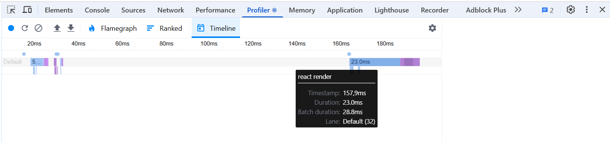
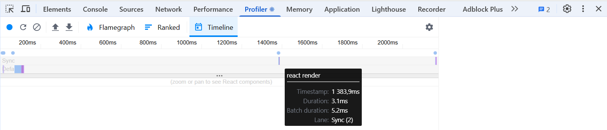
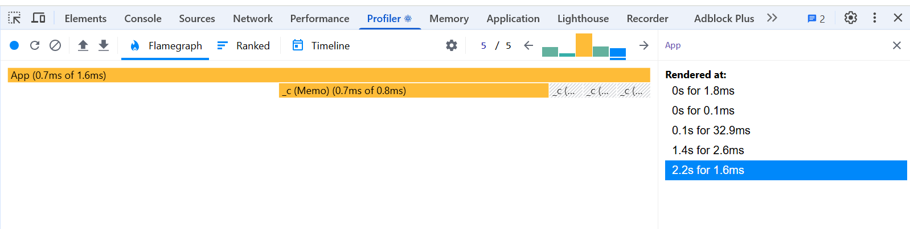

# React performance task

## Performance Before Optimization

### Initial render

- **Render Duration:** 48.9ms
- **Commit Duration:** 0.2ms
- **Interaction:** Loading initial page

Performance Metrics Screenshots

_Timeline (Interactions)_

_Flame graph_

_Ranked chart_

### Sort by name before optimization

- **Render Duration:** 16ms (7.9ms + 7.9ms)
- **Commit Duration:** 0.2ms
- **Interaction:** Sorting countries by name

Performance Metrics Screenshots

_Timeline (Interactions)_

_Flame graph_

_Ranked chart_

### Search country (letter combination "A", then "S")

- **Render Duration:** 74.3ms (48.6ms ("Init render") + 18.4ms ("A") (11.6ms + 6.8ms) + 7.3ms ("S") (6.8ms + 0.5ms))
- **Commit Duration:** 16.8s (0.2ms ("Init render") + 6.4s ("A") + 10.2s ("S"))
- **Interaction:** Changing searchbar input

Performance Metrics Screenshots

_Timeline (Interactions)_

_Flame graph_

_Ranked chart_

## Performance After Optimization

### Initial render

- **Render Duration:** 22.5ms
- **Commit Duration:** 0.2ms
- **Interaction:** Loading initial page

Performance Metrics Screenshots

_Timeline (Interactions)_

_Flame graph_

_Ranked chart_

### Sort by name after optimization

- **Render Duration:** 1.8ms
- **Commit Duration:** 2s
- **Interaction:** Sorting countries by name

Performance Metrics Screenshots

_Timeline (Interactions)_

_Flame graph_

_Ranked chart_

### Search country (letter combination "A", then "S")

- **Render Duration:** 37.1ms (32.9ms ("Init render") + 2.6ms ("A") + 1.6ms ("S"))
- **Commit Duration:** 3.7s (0.1ms ("Init render") + 1.4s ("A") + 2.2s ("S"))
- **Interaction:** Changing searchbar input

Performance Metrics Screenshots

_Timeline (Interactions)_

_Flame graph_

_Ranked chart_

